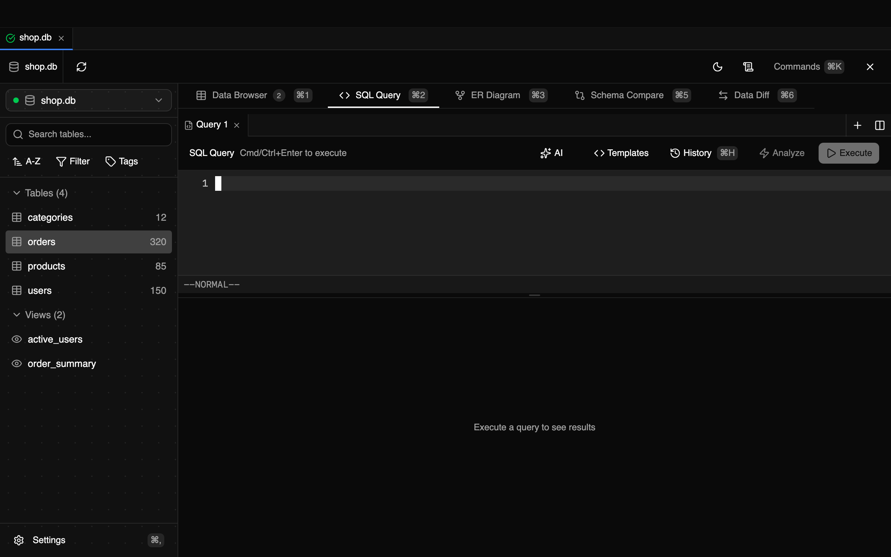

# SQL Pro

<p align="center">
  
</p>

<p align="center">
  <strong>Professional SQLite database manager with SQLCipher support and diff preview</strong>
</p>

<p align="center">
  <a href="https://github.com/kunish-homelab/sql-pro/releases"></a>
  <a href="https://github.com/kunish-homelab/sql-pro/blob/main/LICENSE"></a>
  <a href="https://github.com/kunish-homelab/sql-pro/actions"></a>
  <a href="https://kunish-homelab.github.io/sql-pro/"></a>
</p>

> 🚀 A modern, cross-platform SQLite database manager built with Electron, React, and TypeScript. Features include encrypted database support, visual diff preview for changes, and powerful query tools.</p>

## ✨ Features

<table>
<tr>
<td width="50%">

### 🗄️ Database Management

- **SQLite & SQLCipher** support
- **Encrypted databases** with secure password storage
- **Multiple connections** with tab-based interface
- **Recent databases** quick access

### 📝 Query Tools

- **Monaco editor** with syntax highlighting
- **Intelligent autocomplete** for tables and columns
- **Vim mode** for power users
- **Query history** with search and rerun

</td>
<td width="50%">

### ✏️ Data Operations

- **Inline editing** in data grid
- **Diff preview** before applying changes
- **Bulk operations** for multiple rows
- **Advanced filtering** across all columns

### 🎨 Visualization

- **ER diagrams** with relationships
- **Schema browser** with structure view
- **Dark/Light theme** auto-switching
- **Customizable keyboard shortcuts**

</td>
</tr>
</table>

## 📸 Screenshots

<table>
<tr>
<td width="50%">
  
  <p align="center"><em>Welcome Screen</em></p>
</td>
<td width="50%">
  
  <p align="center"><em>Schema Browser & Data Grid</em></p>
</td>
</tr>
<tr>
<td width="50%">
  
  <p align="center"><em>Inline Data Editing</em></p>
</td>
<td width="50%">
  
  <p align="center"><em>SQL Query Editor</em></p>
</td>
</tr>
</table>

> 📚 **[View full documentation →](https://kunish-homelab.github.io/sql-pro/)**

## 📦 Installation

### Quick Start

Download the latest release for your platform:

| Platform                 | Download                                                                          | Architecture |
| ------------------------ | --------------------------------------------------------------------------------- | ------------ |
| 🍎 macOS (Apple Silicon) | [sql-pro-x.x.x-arm64.dmg](https://github.com/kunish-homelab/sql-pro/releases)     | M1/M2/M3/M4  |
| 🍎 macOS (Intel)         | [sql-pro-x.x.x-x64.dmg](https://github.com/kunish-homelab/sql-pro/releases)       | Intel        |
| 🪟 Windows               | [sql-pro-x.x.x-setup-x64.exe](https://github.com/kunish-homelab/sql-pro/releases) | x64          |
| 🐧 Linux (AppImage)      | [sql-pro-x.x.x-x64.AppImage](https://github.com/kunish-homelab/sql-pro/releases)  | x64          |
| 🐧 Linux (deb)           | [sql-pro-x.x.x-x64.deb](https://github.com/kunish-homelab/sql-pro/releases)       | x64          |

> 💡 **New to SQL Pro?** Check out our [Getting Started Guide](https://kunish-homelab.github.io/sql-pro/getting-started/) for detailed installation instructions and first-time setup.

### Build from Source

**Prerequisites:** Node.js 20+, pnpm 10+

```bash
# Clone the repository
git clone https://github.com/kunish-homelab/sql-pro.git
cd sql-pro

# Install dependencies
pnpm install

# Development mode
pnpm dev

# Build for your platform
pnpm build:mac    # macOS
pnpm build:win    # Windows
pnpm build:linux  # Linux
```

> 🔧 For development setup and contribution guidelines, see [CONTRIBUTING.md](CONTRIBUTING.md)

## 🚀 Quick Usage

1. **Open a Database** → Click "Open Database" or press `Cmd/Ctrl + O`
2. **Browse Schema** → Navigate tables and views in the sidebar
3. **Query Data** → Write SQL in the editor and press `Cmd/Ctrl + Enter`
4. **Edit Data** → Double-click cells to edit, review changes in diff preview
5. **Apply Changes** → Click "Apply Changes" or press `Cmd/Ctrl + S`

### Essential Keyboard Shortcuts

| Action          | macOS         | Windows/Linux  |
| --------------- | ------------- | -------------- |
| Execute query   | `Cmd + Enter` | `Ctrl + Enter` |
| Apply changes   | `Cmd + S`     | `Ctrl + S`     |
| Open database   | `Cmd + O`     | `Ctrl + O`     |
| Command palette | `Cmd + K`     | `Ctrl + K`     |
| Toggle sidebar  | `Cmd + B`     | `Ctrl + B`     |

> ⌨️ **[See all shortcuts →](https://kunish-homelab.github.io/sql-pro/shortcuts)**

## 🛠️ Development

### Project Structure

```
sql-pro/
├── src/
│   ├── main/           # Electron main process
│   │   └── services/   # Database, IPC handlers
│   ├── preload/        # Preload scripts
│   └── renderer/       # React frontend
│       ├── components/ # UI components
│       ├── stores/     # Zustand stores
│       └── routes/     # TanStack Router routes
├── docs/               # VitePress documentation
├── plugin-sdk/         # Plugin development templates
└── resources/          # App icons and assets
```

### Available Scripts

```bash
# Development
pnpm dev              # Start dev server
pnpm dev:mock         # Start with mock data

# Building
pnpm build            # Build application
pnpm build:mac        # Build for macOS
pnpm build:win        # Build for Windows
pnpm build:linux      # Build for Linux

# Code Quality
pnpm lint             # Run ESLint
pnpm format           # Format with Prettier
pnpm typecheck        # TypeScript type checking

# Testing
pnpm test             # Run tests in watch mode
pnpm test:run         # Run tests once
pnpm test:coverage    # Generate coverage report
pnpm test:ui          # Open Vitest UI

# Documentation
pnpm docs:dev         # Start docs dev server
pnpm docs:build       # Build documentation
pnpm screenshots      # Capture app screenshots

# Utilities
pnpm build:icons      # Generate app icons
```

### Testing

The project uses [Vitest](https://vitest.dev/) with comprehensive test coverage:

| Category  | Coverage      | Description                |
| --------- | ------------- | -------------------------- |
| Utilities | 99%+          | Core utility functions     |
| Stores    | 80%+          | State management           |
| SQL Logic | Comprehensive | SQL parsing and formatting |

Run tests during development:

```bash
pnpm test              # Watch mode with auto-reload
pnpm test:coverage     # Generate detailed coverage report
pnpm test:ui           # Interactive test interface
```

### Mock Mode & Screenshots

For demos and documentation without a real database:

```bash
pnpm dev:mock         # Start app with sample data
pnpm screenshots      # Capture documentation screenshots
```

Mock mode provides sample data and realistic responses for testing UI without database files.

> 📖 **For detailed development guidelines, see [CONTRIBUTING.md](CONTRIBUTING.md)**

## 🤝 Contributing

We welcome contributions! Whether you're fixing bugs, adding features, or improving documentation, your help is appreciated.

### How to Contribute

1. **Fork** the repository
2. **Create** a feature branch (`git checkout -b feature/amazing-feature`)
3. **Commit** your changes (`git commit -m 'feat: add amazing feature'`)
4. **Push** to the branch (`git push origin feature/amazing-feature`)
5. **Open** a Pull Request

### Development Setup

```bash
git clone https://github.com/YOUR_USERNAME/sql-pro.git
cd sql-pro
pnpm install
pnpm dev
```

Please read [CONTRIBUTING.md](CONTRIBUTING.md) for detailed guidelines, including:

- Code style and conventions
- Testing requirements
- Commit message format
- Pull request process

## 🗺️ Roadmap

We're actively developing SQL Pro with exciting features planned. See our [detailed roadmap](https://github.com/kunish-homelab/sql-pro/issues) for the full list.

### Current Focus (Q1 2025)

- 🔌 **Plugin System** - Extensible architecture for custom functionality
- 📊 **Query Optimizer** - AI-powered query analysis and suggestions
- 🔄 **Multi-tab Editor** - Work with multiple queries simultaneously
- 📥 **Data Import/Export** - Enhanced CSV, JSON, and Excel support
- 🔍 **Full-text Search** - Fast search across all database content

### Completed ✓

- ✅ Vim mode support (Editor & App navigation)
- ✅ Customizable keyboard shortcuts
- ✅ Bulk edit operations
- ✅ Query history with search
- ✅ ER diagram visualization

> 💡 **Have a feature idea?** [Open a feature request](https://github.com/kunish-homelab/sql-pro/issues/new?template=feature_request.md)

## 📄 License

This project is licensed under the MIT License - see the [LICENSE](LICENSE) file for details.

## 🙏 Acknowledgments

SQL Pro is built with amazing open-source technologies:

- **[Electron](https://www.electronjs.org/)** - Cross-platform desktop framework
- **[React](https://react.dev/)** - UI library
- **[Monaco Editor](https://microsoft.github.io/monaco-editor/)** - VS Code's editor
- **[TanStack Table](https://tanstack.com/table)** - Headless table library
- **[better-sqlite3-multiple-ciphers](https://github.com/nicofuenzalida/better-sqlite3-multiple-ciphers)** - SQLite with encryption
- **[Tailwind CSS](https://tailwindcss.com/)** - Utility-first CSS framework
- **[Zustand](https://zustand-demo.pmnd.rs/)** - State management
- **[Vite](https://vitejs.dev/)** - Build tool and dev server

Special thanks to all [contributors](https://github.com/kunish-homelab/sql-pro/graphs/contributors) who have helped make SQL Pro better!

---

<p align="center">
  <strong>Built with ❤️ by the SQL Pro team</strong><br>
  <a href="https://kunish-homelab.github.io/sql-pro/">Documentation</a> •
  <a href="https://github.com/kunish-homelab/sql-pro/issues">Issues</a> •
  <a href="https://github.com/kunish-homelab/sql-pro/discussions">Discussions</a> •
  <a href="https://github.com/kunish-homelab/sql-pro/releases">Releases</a>
</p>
